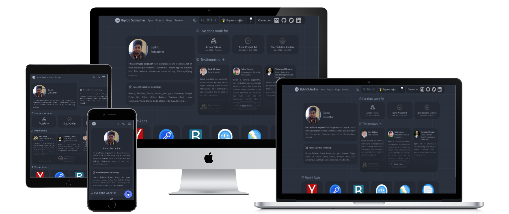

## Portfolio NextJS Project - PNP

<a href="https://biplobsd.me" target="_blank">Live at biplobsd.me</a>

## Overview

The "Portfolio NextJS Project" is a showcase of a personal portfolio website developed using Next.js, Tailwind CSS, and daisyUI. The project aims to provide an intuitive and visually appealing platform to showcase an individual's skills, projects, and achievements. It leverages various technologies and services to enhance the user experience and functionality.

## Features

- Next.js, TailwindCSS, daisyUI
- .me domain free 1 year, if you are student
- Github static page hosting
- Data and Project code sparest repository
- Algolia search, Google map Integrate
- Giscus comment, reaction system
- Open source

## Team

- Biplob Kumar Sutradhar, <a href='https://twitter.com/@biplobsd11'>@biplobsd11</a>: Creator

## Conclusion

The "Portfolio NextJS Project" demonstrates the effective use of Next.js, Tailwind CSS, and daisyUI to create a visually appealing and functional portfolio website. By leveraging GitHub Pages, domain registration, and separate repositories for data and code, the project ensures a seamless development and deployment process. Integration of Algolia search, Google Maps, and Giscus comment system enhances the user experience and encourages engagement. Finally, by embracing open source principles, the project promotes collaboration and knowledge sharing within the developer community.

## Important Links

- Install now : [biplobsd.me/blogs/get-started.md](https:?/biplobsd.me/blogs/get-started.md)
- Pricing : [biplobsd.me/pricing](https://biplobsd.me/pricing)
- PNP Source : [SpeedOut-Source/pnp](https://github.com/SpeedOut-Source/pnp)
- Twitter : [twitter.com/biplobsd11](https://twitter.com/biplobsd11)
